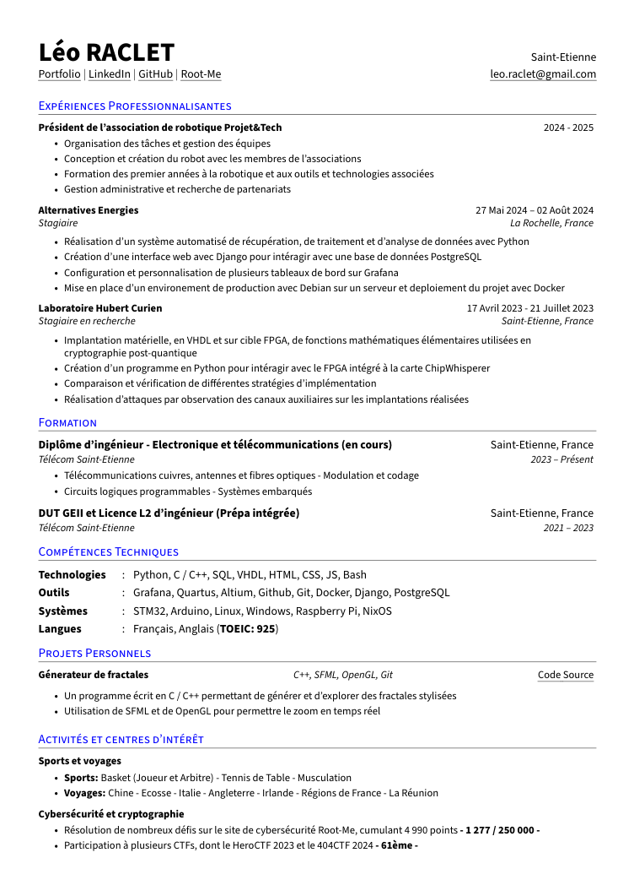
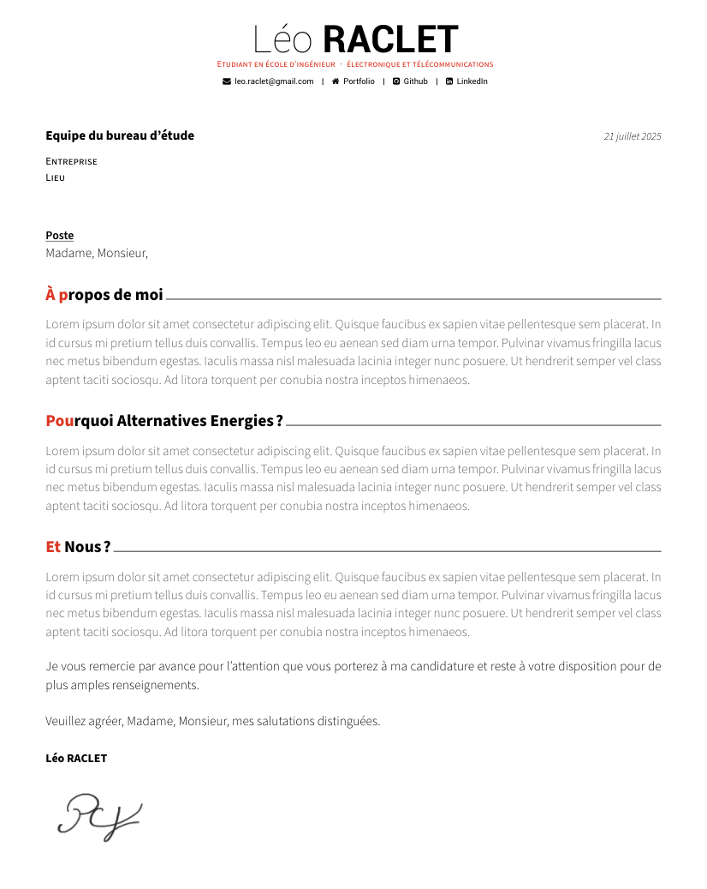
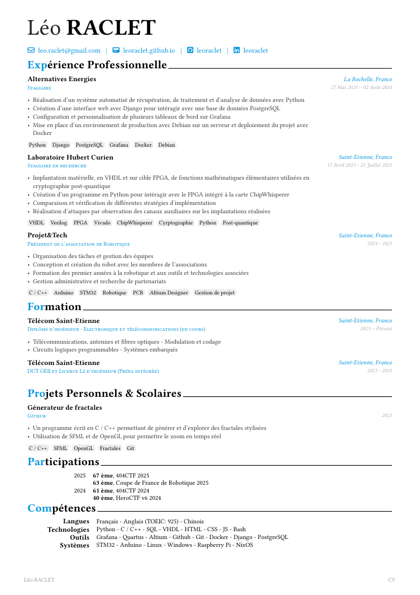
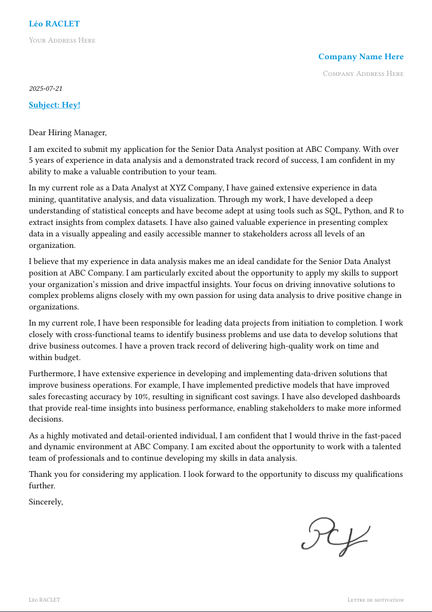

<div align="center"></div>
<h1 align="center">CV Templates</h1>

<div align="center">


</div>

## Table of contents

- [🙏 Acknowledgements](#-acknowledgements)
- [📖 About](#-about)
- [🌟 Showcase](#-showcase)
    - [LaTeX](#latex)
    - [Typst](#typst)
- [🧪 Setup Environment](#-setup-environment)
    - [Recommended Extensions](#recommended-extensions)
- [🚀 Usage](#-usage)
- [📦 Structure](#-structure)
- [📜 License](#-license)

## 🙏 Acknowledgements

> [!NOTE]
> While I have tested these projects and drawn inspiration from them, I personally use my own template, which is located at [`latex/cv/cv.tex`](./latex/cv/cv.tex).
>
> You can see the output presented as the first image in the [Showcase](#-showcase) section.

Sources of inspirations and tests :

- [**Awesome-CV**](https://github.com/posquit0/Awesome-CV) - LaTeX template
- [**Brilliant-CV**](https://github.com/yunanwg/brilliant-CV) - Typst template (himself inspired from **Awesome-CV**)

And more recently the [**RenderCV**](https://github.com/rendercv/rendercv) python project.

## 📖 About

This repository houses templates for my **Resume** and **Cover letters**. There are two versions, one with [LaTeX](https://www.latex-project.org/) and the other with [Typst](https://typst.app/).

## 🌟 Showcase

### LaTeX

|      Resume (my own)       |        Cover Letter        |
| :------------------------: | :------------------------: |
|  |  |

### Typst

|           Resume           |        Cover Letter        |
| :------------------------: | :------------------------: |
|  |  |

## 🧪 Setup Environment

> [!NOTE]
>
> I'm using NixOS as my day-to-day OS, and I have found that **Nix** with **Flakes** was the
> simplest and fastest way for me to setup C/C++ project with external libraries.

To build this project, first make sure you have [Nix](https://nixos.org/download/) installed as a
package manager and [direnv](https://direnv.net/) as a shell extension.

Then, configure it to enable [Flakes](https://nixos.wiki/wiki/flakes) according to your setup.

Once you're ready, you can start by cloning this repo

```bash
git clone https://github.com/leoraclet/cv
cd cv
```

> [!TIP]
>
> Now, **direnv** should load the environment when inside the project directory, if not, try
>
> ```bash
> direnv allow
> ```

### Recommended Extensions

The project is pre-configured with the following VSCode extensions to ensure seamless dependency management and environment setup:

- [Nix Environment Selector](https://github.com/arrterian/nix-env-selector) - Allows switch environment for VSCode using Nix Package Manager
- [Python Envy](https://github.com/teticio/python-envy) - Automatically activate Python virtual environments as you navigate the source code

> [!NOTE]
> You can find the recommended extensions and pre-configured settings under `.vscode/`.

## 🚀 Usage

> [!NOTE]
>
> You can read this simple [Makefile](./Makefile) for all the targets

Make sure you have **LaTeX** or **Typst** installed depending on which one you want to build (better is both).

Then, run

```bash
make [TARGET]
```

or just

```bash
make
```

to build everything into the [**pdfs**](./pdfs/) directory

> [!IMPORTANT]
>
> Ensure you have both installed for this one

## 📦 Structure

- **Directories**

    - [**`.vscode`**](./.vscode/) - Project specific VSCode settings (LaTeX formatting and recommended extensions)
    - [**`assets`**](./assets/) - Illustration images
    - [**`pdfs`**](./pdfs/) - Final PDFs as result of the render process
    - [**`latex`**](./latex/) - LaTeX source files
    - [**`typst`**](./typst/) - Typst source files
    - [**`python`**](./latex/) - YAML source files to be used by RenderCV

- **Files**

    - `flake.nix` - Environment configuration (based on
    [**dev-templates**](https://github.com/the-nix-way/dev-templates))
    - `.envrc` - Used by **direnv** to load **Flakes**
    - `flake.lock` - Used by **Flakes** to version packages
    - `Makefile` - Used to automate checks and analyses

## 📜 License

This project is licensed under the Apache-2.0 License - see the [LICENSE](LICENSE) file for details.
