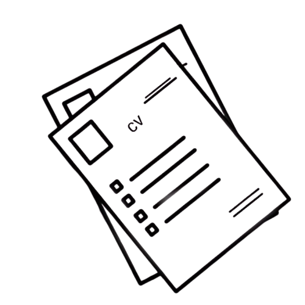

<div align="center"></div>
<h1 align="center">CV & Cover Letter</h1>

<div align="center">


</div>

## Table of Contents

- [Table of Contents](#table-of-contents)
- [🙏 Acknowledgements](#-acknowledgements)
- [📖 About](#-about)
- [🌟 Showcase](#-showcase)
    - [LaTeX](#latex)
    - [Typst](#typst)
- [🚀 Usage](#-usage)
- [📜 License](#-license)

## 🙏 Acknowledgements

Made possible by those beautiful templates :

- [**Awesome-CV**](https://github.com/posquit0/Awesome-CV) - LaTeX template
- [**Brilliant-CV**](https://github.com/yunanwg/brilliant-CV) - Typst template (himself inspired from **Awesome-CV**)

## 📖 About

This repository houses templates for my **CV** and **Cover Letters**. There are two versions, one with [LaTeX](https://www.latex-project.org/) and the other with [Typst](https://typst.app/).

## 🌟 Showcase

### LaTeX

|             CV             |        Cover Letter        |
| :------------------------: | :------------------------: |
|  |  |

### Typst

|             CV             |        Cover Letter        |
| :------------------------: | :------------------------: |
|  |  |

## 🚀 Usage

> [!NOTE]
>
> You can read the simple [Makefile](./Makefile) for all the targets

Make sure you have **LaTeX** or **Typst** installed depending on which one you want to build (better is both).

Then, run

```bash
make [TARGET]
```

or just

```bash
make
```

to build everything into the [**pdfs**](./pdfs/) directory

> [!IMPORTANT]
>
> Ensure you have both installed for this one

## 📜 License

This project is licensed under the Apache-2.0 License - see the [LICENSE](LICENSE) file for details.
